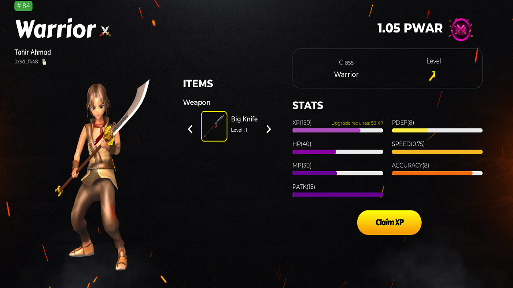

# Ancient Hero

This web3 game is an on-chain pvp strategy game on harmony netwpr that strongly utilized zero knowledge proof to ensure the credibility of players guesses and ensure that the game is not altered. 
Players go in turns to try to guess the correct items in the opponents rack. The first person to guess the correct order and items becomes the winner and is presented with an NFT. The core of the game is built and deployed on the blockchain with every guess made verified by the ZKproof.

With a very cool user interface and a well thought out game play, this promises to be an exciting game which you can play with friends and family.

## Prerequisites

Ensure you have the following installed:

- Node.js >= 16.x
- Git

## 📦 Installation

```bash
git clone https://github.com/0x3ca54/arena-world.git
cd arena-world
npm install
```
## Start:

```bash
npm start
```

## Stack

```
Frontend - React
Core Backend - Solidity 
Snarkjs Prover - Nodejs
```




